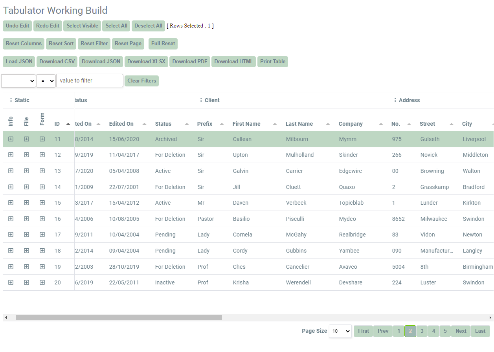
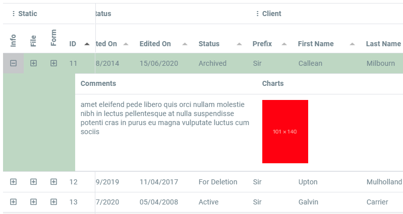
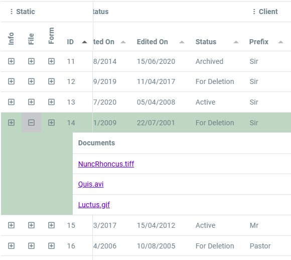
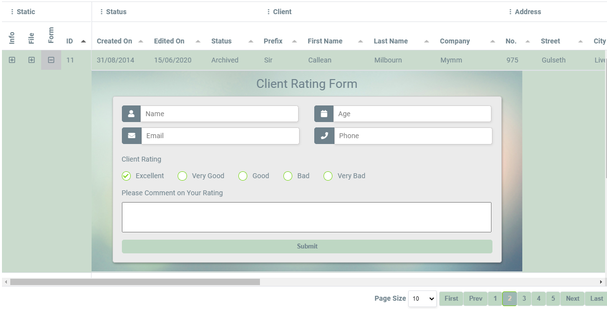

# Tabulator-Local

## A Better Example with added features.

Dropdown Comments, File Links, or Whole Forms

Setup for local file, but can also use an API.

First Four Columns are Frozen.

### Dropdown Form

Visit this link to try it out:

[https://avertry.github.io/Tabulator-Local/](https://avertry.github.io/Tabulator-Local/)

See Update Log for recent changes.
